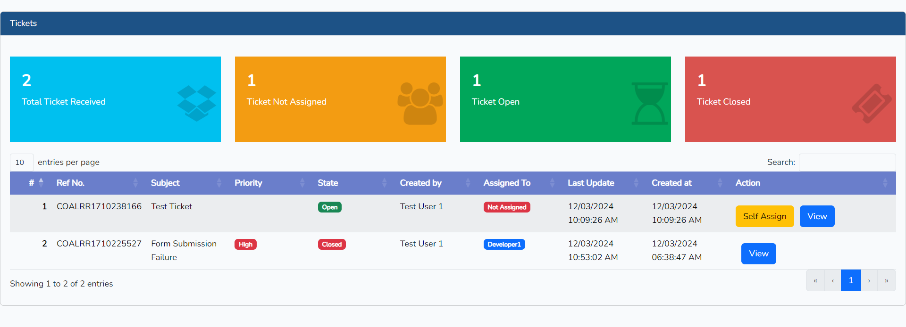
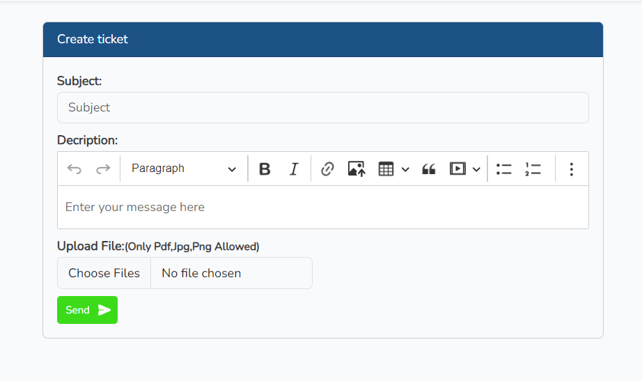
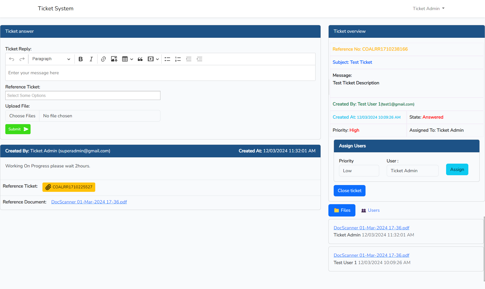
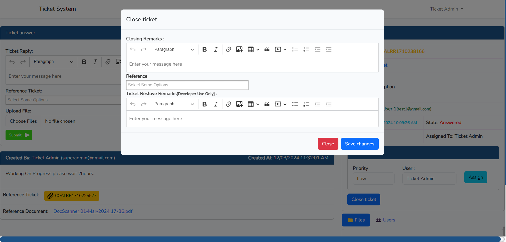

# Laravel Tickets

[](https://packagist.org/packages/rexlmanu/laravel-tickets)
[](https://travis-ci.org/rexlmanu/laravel-tickets)
[](https://scrutinizer-ci.com/g/rexlmanu/laravel-tickets)
[](https://packagist.org/packages/rexlmanu/laravel-tickets)

Simple but effective solution to provide support. Due to its lightweight construction, it fits into any project. In addition, it offers a wide range of configuration options from the start and is therefore suitable for any area.

## Features

- Highly configurable
- auto closing
- file upload support
- permission support
- ticket categories
- priority
- easy to customize
- uuid support
- declare ticket reference
- multiple language support

## Preview

Ticket Dashboard:

Ticket creation:

Ticket show And Assign:

Ticket Close:


## Todos

- Improve documentation
- tailwind and vue frontend
- admin ticket scaffold
- unit tests
- uuid:
  - rule,
  - migrations
  - controller stuff

## Installation

You can install the package via composer:

```bash
composer require dassuman/laravel-tickets:dev-main
```

After the installation
```bash
php artisan vendor:publish --provider=Dassuman\LaravelTickets\LaravelTicketsServiceProvider
```

## Documentation

Currently the views are only implemented for bootstrap. After publishing, you should implement the layouts.

The trait ``HasTickets`` should be added to the user model
```php

use Dassuman\LaravelTickets\Traits\HasTickets;

class User
{
    use HasTickets; // important for laravel-tickets
}
```

The ticket routes can be implemented via the macro
```php

use Illuminate\Routing\Controller;
use Dassuman\LaravelTickets\Controllers\TicketControllable;

class TicketController extends Controller {

  use TicketControllable;

}

Route::tickets( TicketController::class );
```

Config: All points of the configuration are documented.

## Contributing

Please see [CONTRIBUTING](CONTRIBUTING.md) for details.

### Security

If you discover any security related issues, please email dass.suman126@gmail.com instead of using the issue tracker.

## Credits

- [Anirudha Pal]
- [Suman DAs](https://github.com/dassuman126)

## License

The MIT License (MIT). Please see [License File](LICENSE.md) for more information.
